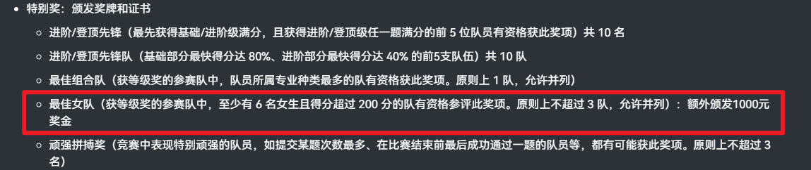

# 3.2. 队伍类型

在算法竞赛中，参赛队伍通常会根据其资格、组成或目的，被划分为不同的类型。理解这些分类有助于明确参赛目标和可获得的权益。以下将详细介绍几种主要的队伍类型：

## 正式队伍

正式参赛队伍是指符合赛事章程中所有资格要求、旨在参与正式排名并角逐奖项的常规队伍。

- **参赛资格：** 队员通常需满足特定的身份要求（如在校大学生、特定学年段学生），并符合年龄、学历、注册学校等规定。例如，在ICPC和CCPC中，正式队员通常要求为在校本科生或研究生，且未达到特定参赛次数上限。
- **评奖资格：** 仅正式参赛队伍有资格参与最终的排名评定，并根据其表现获得相应的奖项和荣誉。

下面分别以ICPC 2024年[南京站](https://icpc.pku.edu.cn/tzgg/161577.htm)为例

## 打星队伍

打星队伍是一种特殊类型的参赛队伍，其主要特点是参与比赛但不参与正式排名和奖项的评定。这种机制旨在为特定群体提供参与竞赛的机会，同时不影响正式队伍的竞争格局。

- **参赛性质：** 打星队伍通常被视为“体验参赛”或“练习参赛”，其成绩通常会在比赛结果中单独标识（例如，排名前/后带有星号 `*`），不计入正式的榜单排名。
- **参赛目的：** 为不符合正式参赛资格但希望体验竞赛、提升技能、进行训练或作为指导的个人/团体提供平台。
- **不参与评奖：** 打星队伍无法获得比赛的任何正式奖项和荣誉（极个别赛站会为打星队伍发放奖牌）。
- **常见构成：**
  - **非在校学生：** 如中小学生，他们可能在年龄或学历上不满足大学生竞赛的正式参赛要求。
  - **社会人士/在职人员：** 已毕业或在企业工作的编程爱好者。
  - **指导教师/教练：** 为了体验比赛或检验题目难度而组队参赛的教师。
  - **跨校组队：** 在某些严格要求同校组队的比赛中，来自不同学校的选手若想共同参赛，可能需要以打星队身份报名。
  - **超出参赛次数限制的选手：** 某些赛事对选手参赛次数有严格限制，超过限制的选手若仍想参与，可以作为打星队员。
  - **测试队伍：** 组委会内部为了测试系统或题目而设立的队伍。
- **示例：** 在ICPC、CCPC等赛事中，经常可以看到一些由中学信息学奥赛选手、教练或校友组成的打星队伍。

## 女子队伍

女子队伍是指所有成员均为（个别比赛要求大多数）生理性别为女性的选手组成的队伍。在当前的算法竞赛环境中，设立女子队伍是为了鼓励更多女性参与编程和算法领域，并促进性别多样性。

- **队伍构成：** 队伍中所有队员必须均为生理性别为女性的选手。
- **优待政策：** 在许多重要的算法竞赛中，女子队伍会享有一些特殊的优待和鼓励政策，以体现对女性参赛者的支持：
  - **单独评奖：** 很多比赛会设立专门的“最佳女子队伍奖”或“女子组奖项”，给予额外表彰，不与其他队伍混合排名。
  - **优先发放名额：** 在一些晋级赛或名额有限的比赛中，女子队伍可能在名额分配上享有一定的优先权或额外名额。
  - **专属奖励：** 除了荣誉之外，可能会有针对女子队伍的额外奖品或奖励。
- **设立目的：** 这些政策旨在弥补历史和现实中女性在STEM（科学、技术、工程、数学）领域参与度相对较低的现状，提供一个更具包容性和激励性的竞赛环境，吸引和培养更多女性编程人才。
- **示例：** 在ICPC世界总决赛、CCPC总决赛等顶级赛事中，均设有专门的女子队伍奖项和相关激励机制。

以[团体程序设计天梯赛](https://gplt.patest.cn/regulation#%E8%8E%B7%E5%A5%96%E6%AF%94%E4%BE%8B)为例

