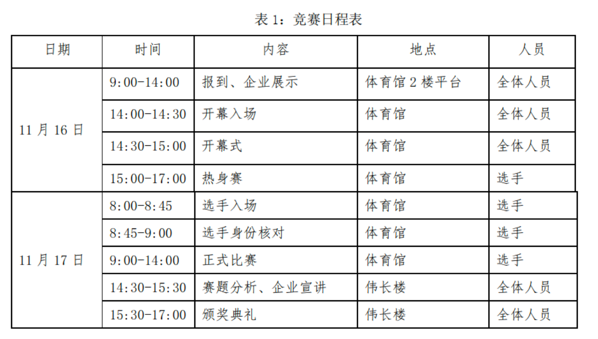
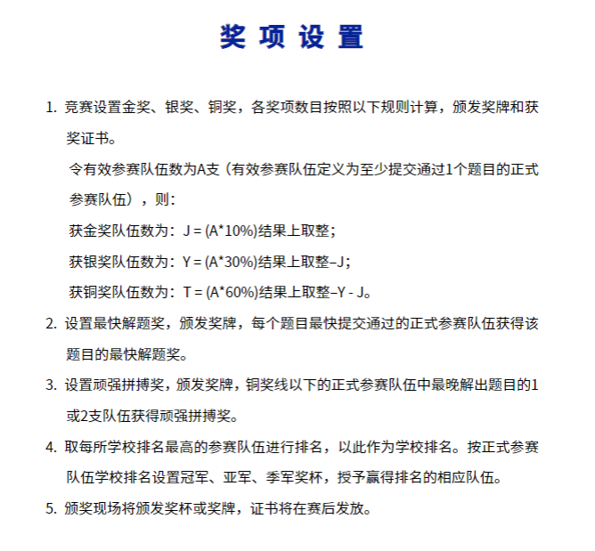

# 4.1. XCPC

## 比赛流程

以[2024年上海站](https://icpc.pku.edu.cn/tzgg/161744.htm)为例

也存在热身赛和正式赛在同一天的情况。

以2025年南昌邀请赛为例

## 比赛规则

以2025年山东省赛为例

## 奖项设置

以2025年山东省赛为例

## 比赛场地

竞赛场地通常选择具备充足空间和完善电力、网络基础设施的场所。

- **标准配置：** 大多数大型XCPC赛事会选择**体育馆**作为主要比赛场地，因为体育馆通常空间开阔，便于容纳大量参赛队伍，并提供相对舒适的比赛环境。
- **特殊情况：** 在某些特定情况下，例如主办方经费受限、参赛人数远超预期或受场地可用性限制时，比赛可能会考虑选择**高校机房**作为场地。
- **理解与支持：** 无论比赛场地如何，组织一场大规模的算法竞赛涉及巨大的**人力、物力和财力投入**。主办方在筹备过程中面临诸多挑战，可能存在难以预见的困难。因此，恳请各位参赛者对主办方的努力给予充分的理解与支持，共同维护良好的竞赛氛围。

## 比赛语言

目前绝大多数比赛都使用以**中文**为主的题面，个别赛站会选择使用英文题目

- **趋势变化：** 自**2022年ICPC南京区域赛**首次尝试提供中文题面以来，国内的ICPC和CCPC区域赛已普遍开始为参赛选手提供**中文与英文双语题面**。这一举措极大地方便了国内选手，降低了语言障碍。
- **例外情况：** 若比赛采用**海外（非中国大陆）提供的题目**，仍可能仅提供**英文题面**。因此，参赛选手仍需具备一定的英文阅读能力，以应对可能的纯英文题目。

## 比赛赠品

主办方通常会为参赛选手提供一定的福利和纪念品，以提升参赛体验。

- **餐饮服务：** 一般而言，主办学校会为所有参赛选手（包括打星队伍）提供**免费的餐券或赛时午餐**，确保选手在比赛期间的餐饮需求。
- **伴手礼：** 参赛选手还会收到主办方提供的伴手礼。礼品的种类和质量通常与比赛的**报名费用**以及主办方的投入水平相关。

## 比赛用品

除了必要的编程工具，参赛选手需要准备一些个人物品以应对比赛需求。

- **必备证件：** **身份证**和**学生证**是参加比赛的必备身份证明，请务必随身携带并妥善保管。
- **建议携带物品：** 个人习惯不同，但通常建议携带：
  - **纸笔：** 尽管赛场通常会提供草稿纸和笔，但携带个人习惯使用的纸笔可以提升思考效率。
  - **饮用水/零食：** 赛场一般会提供饮用水，但可根据个人喜好携带零食或饮料，以补充能量。
  - **笔记本电脑：** 用于比赛前后加训，提升竞技状态。
  - **个性化纪念品：** 例如徽章（吧唧），可在赛后用于与群友面基交流，作为小纪念品。
  - **换洗衣服、洗漱用品：** 若比赛持续多日或涉及住宿，则需准备。

## 主办方方面

举办一场XCPC赛事是一项极其复杂且耗费巨大的工程。

- **成本压力：** 赛事组织涉及场地租赁、设备调试、网络搭建、题目准备、评测系统维护、志愿者招募培训、餐饮住宿安排、奖品采购等诸多环节，大概率会有亏损的情况。
- **人力物力消耗：** 需要投入大量的人力资源（包括志愿者、技术人员、管理人员）和物力资源（服务器、网络设备、电脑等）。
- **理解与感谢：** 鉴于主办方为推动算法竞赛发展所付出的巨大努力和牺牲，恳请所有参赛者在享受比赛的同时，对主办方可能存在的不足之处给予充分的**理解和包容**，并对其辛勤付出致以诚挚的感谢。

## 赛时策略与注意事项

比赛期间的决策和应变能力对团队成绩至关重要。

- **题目数量与首杀：** 一场XCPC比赛通常包含约**10至13道题目**。如果团队是全场第一个成功通过（AC）某道题目的队伍，通常会获得额外的“**首杀（First Blood）**”奖励，这是对团队快速解题能力的肯定。
- **允许携带资料：** XCPC赛制相对宽松，通常允许选手携带**任意书籍和纸质资料**（例如算法教材、手写笔记、模板代码打印件等）。但**严禁携带任何电子设备和电子资料**进入比赛区。
- **餐饮与休息：** 允许选手携带个人食物和零食进入比赛区域，以便在比赛中随时补充能量。
- **代码打印与思考：** 由于每支队伍只有一台比赛用电脑，为了最大化团队效率，选手可以请现场**志愿者协助打印代码**。队员可以拿着打印出的代码或题目到休息区或非比赛电脑区域进行思考、讨论和调试，从而实现“三个人同时工作”的状态。
- **“榜歪了”现象：** 在比赛中，有时强队会意外地快速解决一道被普遍认为是难题的题目，导致排行榜上这道题目的通过人数迅速增加。这可能会给其他队伍造成“这道题其实不难”的错觉，从而引诱大家尝试，导致时间和罚时的浪费。这种现象通常被称为“**榜歪了**”。

##  团队协作与队友选择

XCPC赛事的核心是**三人团队协作**。一个高效的团队远超个人能力的总和。

- **团队的重要性：** 尽管每年都会出现出几位“传奇单挑王”（即一人解决大部分甚至全部问题），但对于绝大多数队伍而言，团队协作是取得好成绩的关键。理想的组队应追求**1 + 1 + 1 > 3**的效果。
- **队友选择与培养：**
  - **共同训练与进步：** 团队成员应尽可能做到**共同训练，共同进步**。这意味着队员之间要互相督促、交流学习经验，共同克服难关。
  - **避免无效队友：** 如果队友长期不训练且无法在比赛中发挥应有作用，这不仅会影响团队的比赛成绩，更可能对其他队员的训练心态造成负面影响。在这种情况下，重新评估队伍组成是必要的。（该t就t，别心软）
- **方向分工：** 为了更有效地提升团队整体实力和覆盖知识点，建议团队成员进行**方向分工**，每个人选择两到三个算法或数据结构方向进行专精学习。
  - **示例分工：** 假设团队有A、B、C三名成员：
    - A：可专攻**数学**和**计算几何**。
    - B：可专攻**图论**和**数据结构**。
    - C：可专攻**字符串**和**动态规划**。
  - **并非绝对专精：** 所谓“专精”并非指其他方向完全不学。相反，团队成员仍需对所有常见算法和数据结构有基本了解。专精的目的是确保在比赛中，对于任何一个考点，团队中至少有一人能够深入理解并具备解决能力，从而形成高效的知识互补体系。这种分工有助于分担学习任务量，更有效地增强团队的整体竞争力。