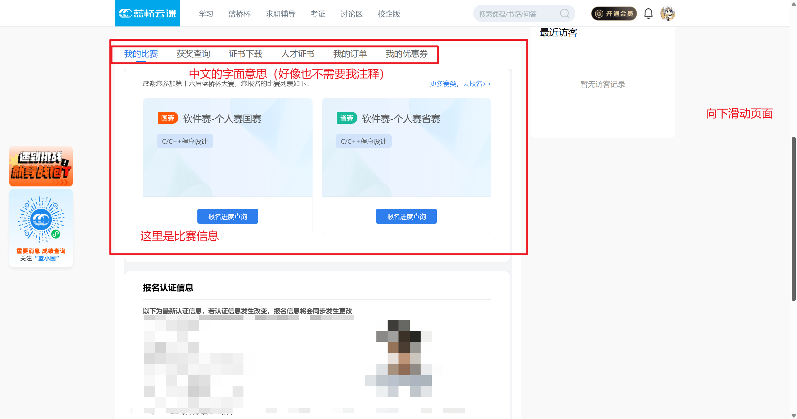
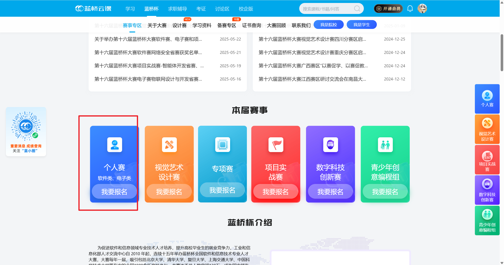

# 4.3. 蓝桥杯

## 比赛介绍

详细的可以见[蓝桥杯大赛章程](https://dasai.lanqiao.cn/notices/839/)

>为贯彻落实全国新型工业化推进大会和全国教育大会有关精神，进一步提高学生工程实践和就业能力，推动产教融合，为制造强国和网络强国建设提供人才服务支撑，工业和信息化部人才交流中心决定举办第十六届蓝桥杯全国软件和信息技术专业人才大赛（以下简称大赛）。大赛分为高等教育组和青少组，高等教育组连续5年入选中国高等教育学会《全国普通高校大学生竞赛分析报告》竞赛目录，青少组进入教育部“2022-2025学年面向中小学生的全国性竞赛活动名单”。现将第十六届蓝桥杯大赛高等教育组章程公布如下。大赛官方网站：dasai.lanqiao.cn。

蓝桥杯大赛采用 **OI 赛制**，即所有题目仅根据最后一次提交判分，且分数需在赛后统一公布。省赛成绩通常在两周后发布，每道题目可获得部分分。我们通常参加的类别是**软件赛**。

蓝桥杯分为研究生组、A组、B组和C组。

- **A组** 面向985/211高校在校生。

- **B组** 面向其他高校在校生。

- C组 面向专科在校生。

  参赛者可以向上报名（如C组可报A组），但不可向下报名（如A组不能参加B组）。

蓝桥杯省赛通常在每年的 **四月** 举行，国赛则在 **六月** 举行。

- **省赛** 为线上形式，通常需前往承办赛点学校参赛。
- **国赛** 一般在每个省的一两个赛点学校线下进行。国赛成绩公布较快，通常在一两天至一周内。国赛选手会获赠蓝桥杯T恤，国赛一等奖获得者还将有额外礼品。

省赛获奖比例为：10%一等奖（晋级国赛），20%二等奖，30%三等奖，40%优秀奖。四个组别独立评奖。

国赛获奖比例为：5%一等奖，20%二等奖，35%三等奖，40%优秀奖。

## 主页

[蓝桥杯主页](https://dasai.lanqiao.cn/)

## 个人主页

一般用于查询比赛信息和下载证书

## 报名参赛

一般院校都会组织报名，学生需要做的是完成实名认证，填写报名信息和报名缴费（学校给缴费的话当我没说）

这里因为写博客的时候已经报名截止了，所以没办法继续截图，不过流程不难顺着引导即可完成报名
