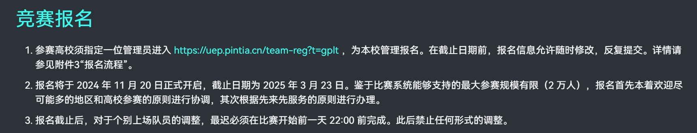
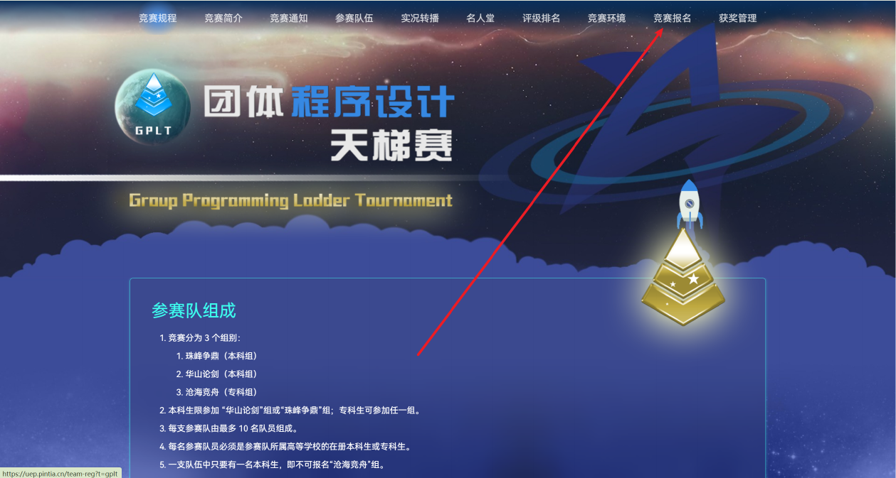

# 4.4. 团体程序设计天梯赛

[团体程序设计天梯赛](https://gplt.patest.cn/regulation)

天梯赛（中国高校计算机大赛 - 天梯赛）是一项面向高校学生的算法竞赛，其赛制和组织方式具有鲜明特点：

- **赛制与形式：** 天梯赛采用 **IOI 赛制**，允许有限次数提交并可获得部分分，无罚时惩罚，最终成绩以最高分为准。比赛形式为**线上竞赛**，并辅以 **双机位监考**（通过OMS系统进行），赛时通常为三小时且中途不允许上厕所。

- **组队与奖项：** 比赛采用**组队赛制**，每支队伍最多可由十人组成。奖项设置上，既有**个人奖项**也有**团队奖项**，其中个人奖项的评选需满足分数大于等于175分的要求。

- **竞赛分组：** 比赛根据参赛学生的学历背景分为三个组别：

  - **珠峰争鼎（本科组）**

  - **华山论剑（本科组）**

  - **沧海竞舟（专科组）**

    通常情况下，珠峰争鼎组的竞争最为激烈。

更详细的规则请参阅大赛官方主页上的竞赛规程。

## 主页

## 报名

如果在这之前你的学校从来没有参与过，那么报名首先你需要申请教练账号，按照下图申请即可

关于报名费用问题可见下图

