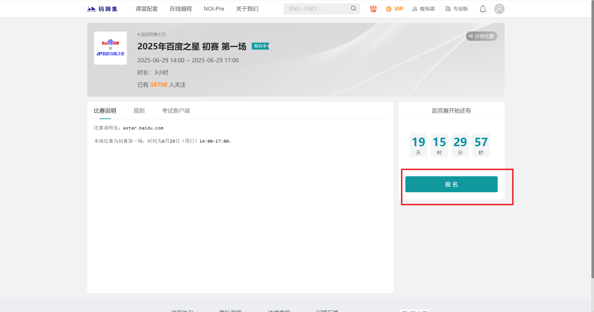

# 4.5. 百度之星

[百度之星](https://www.matiji.net/exam/contest/astar?id=13)

百度之星程序设计大赛是一项具有较高知名度和影响力的算法竞赛，其赛制特点使其成为衡量选手个人编程竞技水平的重要平台之一。

- **赛制特点：** 百度之星采用**个人ACM赛制**，比赛时长通常为**三个小时**。这意味着选手需在规定时间内独立完成题目，并遵循ACM赛制规则，如实时反馈、无部分分、以及累计罚时等。
- **竞赛价值：** 获得百度之星国赛奖项具有**较高的含金量**。由于其个人ACM赛制的特点，百度之星能够相对直观地**体现参赛选手的个人竞赛水平**，是检验和提升个人算法能力的重要舞台。

## 主页

## 报名

主页下拉找到下图

点击想要报名的场次进入到下图页面，点击红框按钮完善信息与缴费即可完成报名

