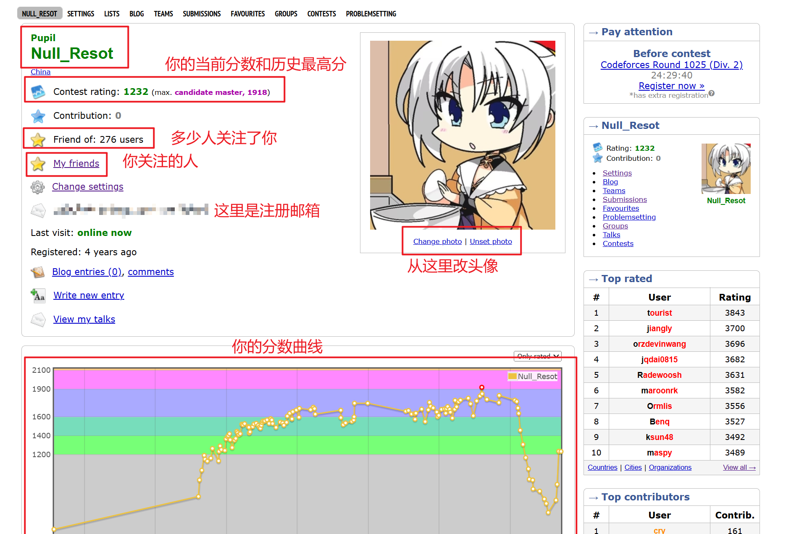

# 5.2. codeforces

推荐插件：[codeforces better](https://greasyfork.org/zh-CN/scripts/465777-codeforces-better)

另外还有carrot，这个插件要在chrome的应用商店下载，这个插件可以赛时查看自己的表现分（自己当时的排名对标cf的多少rating）

接下来说明下codeforces最常用的几个情况，这里挑最关键的几个讲

## home

## contests

这里额外说一点，cf常见的比赛分为div1,div2,div3,div4, edu

| 类别        | 计分区域                                                 | 备注                         |
| ----------- | -------------------------------------------------------- | ---------------------------- |
| div1        | 1900+                                                    | 难度最高，一般A题是div2的C题 |
| div2        | 如果同时举办div1: [0, 1900)，如果单独举办div2：[0, 2100) | 最常举办的比赛               |
| div3        | [0, 1600)                                                | 同样适用于新手参与的比赛     |
| div4        | [0, 1400)                                                | 最简单的比赛                 |
| edu         | [0, 2100)，一般对标div2                                  | 会出很多典题，比较教育选手   |
| div1 + div2 | all                                                      |                              |

Codeforces Div3 / 4 & Educational Div2 为 ACM 赛制

Codeforces Div1 / 2 / 1+2 为基于 ACM 赛制的 CF 赛制，其核心要点为题目具有初始分值，随比赛时间进行流逝，错误提交由罚时 20 分钟改为罚分 50 ，以积分进行排行。

## contest

随意点进一个比赛中，这里也有很多页面，我们挨个儿说

## gym

很多xcpc类的比赛可以在cf上vp，也就是在gym上找到相应的比赛去做

关于xcpc比赛还有牛客，洛谷，qoj，uccup等网站都会有比赛，因为有些比赛只会出现在某一个平台，想vp的话可以直接问群友在哪

## problems

板刷cf一般就是指从这里筛选难度区间后开始刷题	

随意点进一个题目的页面是这样的

## 个人主页

顺带讲一下cf的颜色分段

| 分段         | 段位                               | 颜色 |
| ------------ | ---------------------------------- | ---- |
| [0, 1200)    | newbie                             | 灰名 |
| [1200, 1400) | pupil                              | 绿名 |
| [1400, 1600) | specialist                         | 青名 |
| [1600, 1900) | expert                             | 蓝名 |
| [1900, 2100) | candidate master                   | 紫名 |
| [2100, 2300) | master                             | 橙名 |
| [2300, 2400) | international master               | 黄名 |
| [2400, 2600) | grandmaster                        | 红名 |
| [2600, 3000) | international grandmaster          | 红名 |
| [3000, 4000) | legendary grandmaster              | 黑红 |
| 4000+        | jiangly/tourist （以你的id命名！） | 红黑 |
