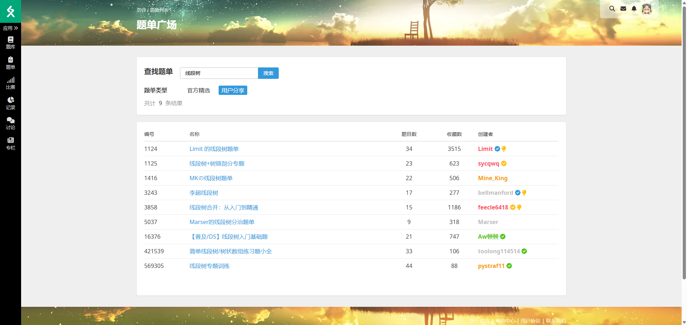
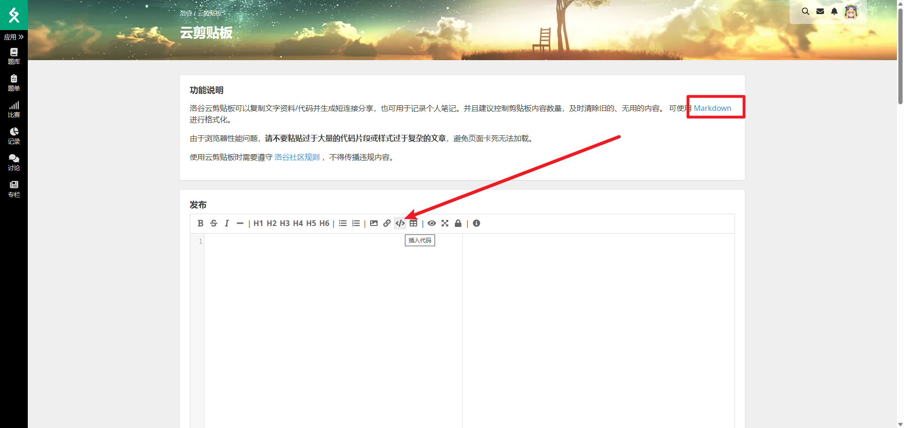

# 5.5. 洛谷

老牌竞赛网站了，功能十分齐全，鉴于洛谷的功能实在是太多，所以这里我只挑我认为必须要知道的功能/页面来介绍

如果想要详细完善的了解洛谷可以看官方文档：[洛谷主站操作指南](https://help.luogu.com.cn/manual/luogu)

## 主页


## 个人页面

### 主页


### 专栏

在专栏区可以发布自己的题解/知识向博客等文章


### 练习

洛谷并不需要安装额外的插件就可以看到自己的做题详细数据


### 我的

这里分成三部分——加入的团队，参与的比赛和发布的贴子

洛谷有着功能十分强大的团队系统，这部分会在后面详细介绍


比赛这里可以查看自己参与过哪些比赛


帖子这里可以用于发布求助帖之类的内容


### 题库

如果有兴趣与能力自己造题的话，那么可以通过这个页面加上自己创造的题目，比赛与题单页面同理


## 题库

洛谷强大之处在于它丰富的题库与方便的筛选功能


### 题目难度

洛谷的题目难度从低到高分别是：

<span style="background:#ff4d6a; color:white; padding:2px 6px; border-radius:4px;">入门</span>，<span style="background:#f5a623; color:white; padding:2px 6px; border-radius:4px;">普及−</span>，<span style="background:#f8b500; color:white; padding:2px 6px; border-radius:4px;">普及/提高−</span>，<span style="background:#7ed321; color:white; padding:2px 6px; border-radius:4px;">普及+/提高</span>，<span style="background:#4a90e2; color:white; padding:2px 6px; border-radius:4px;">提高+/省选−</span>，<span style="background:#bd10e0; color:white; padding:2px 6px; border-radius:4px;">省选/NOI−</span>，<span style="background:#0b1f66; color:white; padding:2px 6px; border-radius:4px;">NOI/NOI+/CTSC</span>

### 筛选

以筛选2024年蓝桥杯国赛题目为例


注意要把所属题库选择洛谷，这样我们就可以筛选出2024年的蓝桥杯国赛题目了

注意蓝桥杯题目的数据是洛谷方自造数据，非官方数据


### 其他网站

我们可以注意到**所处题库**中包含了其他网站，也就是说我们是可以在洛谷去做其他网站上的题目（目前因为一些原因codeforces和atcoder的题目无法提交），我们也可以通过洛谷直接去看一些题目的汉化题意（感谢好心人的汉化）


## 题单

洛谷的题单功能我认为是非常优秀的功能，刚入门学习语法/算法可以做官方精选题单，去刷一些高难度算法也可以在用户分享题单中找相关算法的题目


例如我们刚刚学会了线段树，现在想要刷点例题，可以通过搜索功能快速找到相应的题单




而进入题单后还会有介绍部分，有些题单并没有设置题目列表，但是需要做的题都在题单简介中分类了


## 专栏

我觉得洛谷的专栏质量还是很高的，有很多算法理论讲解博客都非常优秀，洛谷也有洛谷日报这样的精选合集，如果想补一下技能的话可以来专栏区进行搜索相关内容学习


## 云剪贴板

如果你想请教群友一些题目，你已经写好了代码但是找不到bug，请不要直接粘贴代码发过去，这很折磨。所以这个时候就需要云剪贴板的帮助了，而洛谷就提供了云剪贴板的功能（也有很多网站有云剪贴板的功能）

首先在洛谷的左侧工具栏中点击 `应用>>` 部分查看二级菜单，选中 `云剪贴板` 进入，或者是直接点击这个url也可以：[洛谷云剪贴板](https://www.luogu.com.cn/paste)


如果想要粘贴代码的话可以根据下图箭头指示的 `插入代码` 功能来插入代码。



洛谷的云剪贴板是支持markdown语法的，事实上上面的 `插入代码` 功能本质上是直接帮你写一部分markdown语句，所以你可以选择直接写markdown的语法来插入代码，例如

````
```cpp
你的代码
```
````

其中 `cpp` 表示的是 `cplusplus` 也就是 `c++`，如果是 `python` 语言的话就把 `cpp` 换成 `python`，如果是 `java` 语法就换成 `java`

## 团队

洛谷有着很优秀的团队功能，配合上洛谷题库用于平时的团队训练是很实用的


例如想要让集训队一起训练的话我们可以根据情况建立一个作业/题单/比赛，下面以建立比赛为例


点击保存后我们可以进入题目编辑页面，通过搜索题号加入题目来组织比赛题目


这样我们就建立好了一个比赛了


