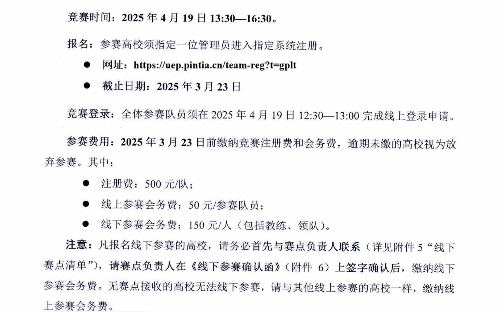
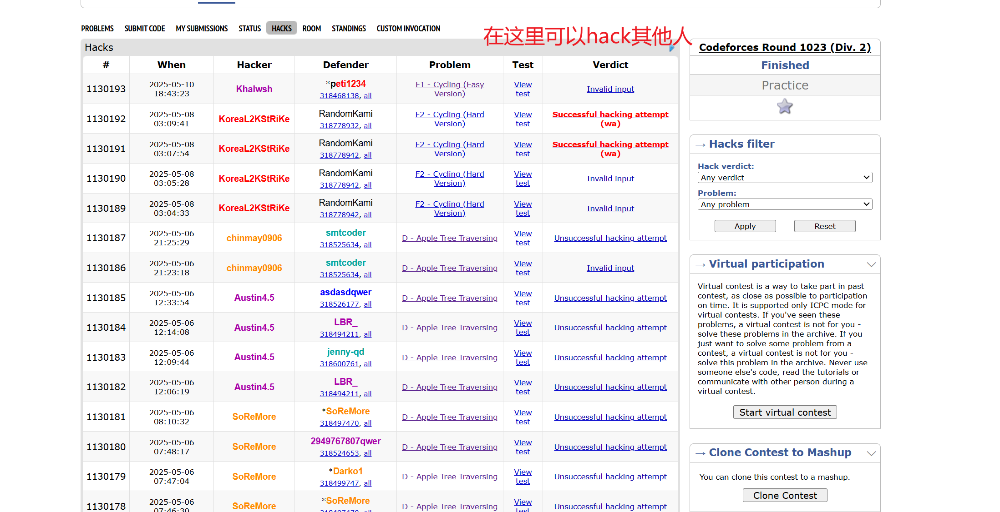
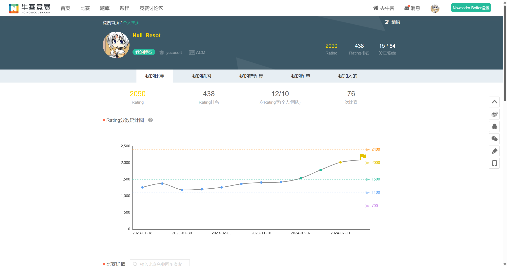
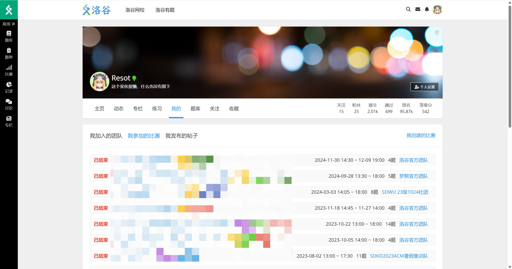
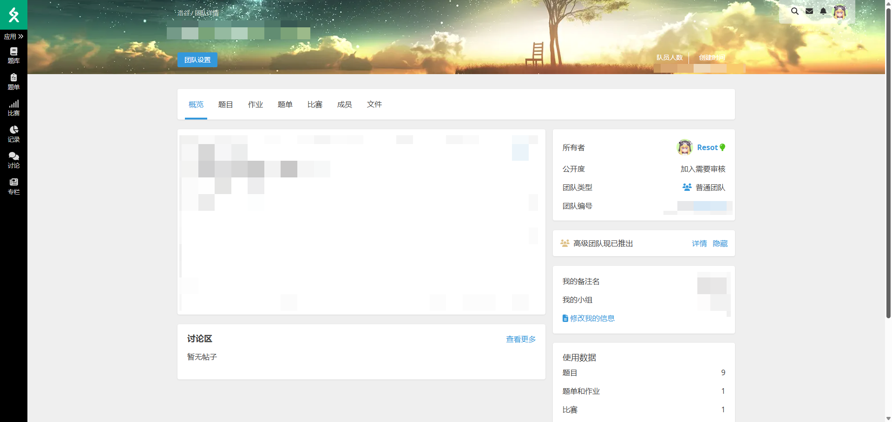
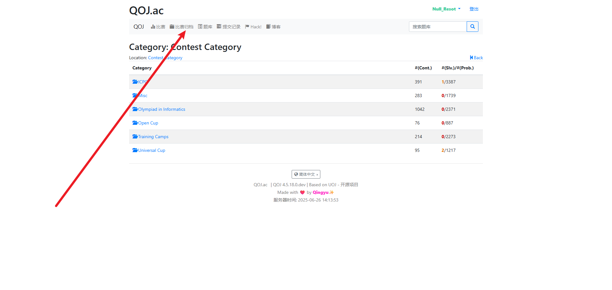

## 比赛介绍

### XCPC

#### 比赛流程

以[2024年上海站](https://icpc.pku.edu.cn/tzgg/161744.htm)为例


也存在热身赛和正式赛在同一天的情况。

以2025年南昌邀请赛为例


#### 比赛规则

以2025年山东省赛为例


#### 奖项设置

以2025年山东省赛为例


#### 比赛场地

竞赛场地通常选择具备充足空间和完善电力、网络基础设施的场所。

- **标准配置：** 大多数大型XCPC赛事会选择**体育馆**作为主要比赛场地，因为体育馆通常空间开阔，便于容纳大量参赛队伍，并提供相对舒适的比赛环境。
- **特殊情况：** 在某些特定情况下，例如主办方经费受限、参赛人数远超预期或受场地可用性限制时，比赛可能会考虑选择**高校机房**作为场地。
- **理解与支持：** 无论比赛场地如何，组织一场大规模的算法竞赛涉及巨大的**人力、物力和财力投入**。主办方在筹备过程中面临诸多挑战，可能存在难以预见的困难。因此，恳请各位参赛者对主办方的努力给予充分的理解与支持，共同维护良好的竞赛氛围。

#### 比赛语言

目前绝大多数比赛都使用以**中文**为主的题面，个别赛站会选择使用英文题目

- **趋势变化：** 自**2022年ICPC南京区域赛**首次尝试提供中文题面以来，国内的ICPC和CCPC区域赛已普遍开始为参赛选手提供**中文与英文双语题面**。这一举措极大地方便了国内选手，降低了语言障碍。
- **例外情况：** 若比赛采用**海外（非中国大陆）提供的题目**，仍可能仅提供**英文题面**。因此，参赛选手仍需具备一定的英文阅读能力，以应对可能的纯英文题目。

#### 比赛赠品

主办方通常会为参赛选手提供一定的福利和纪念品，以提升参赛体验。

- **餐饮服务：** 一般而言，主办学校会为所有参赛选手（包括打星队伍）提供**免费的餐券或赛时午餐**，确保选手在比赛期间的餐饮需求。
- **伴手礼：** 参赛选手还会收到主办方提供的伴手礼。礼品的种类和质量通常与比赛的**报名费用**以及主办方的投入水平相关。

#### 比赛用品

除了必要的编程工具，参赛选手需要准备一些个人物品以应对比赛需求。

- **必备证件：** **身份证**和**学生证**是参加比赛的必备身份证明，请务必随身携带并妥善保管。
- **建议携带物品：** 个人习惯不同，但通常建议携带：
  - **纸笔：** 尽管赛场通常会提供草稿纸和笔，但携带个人习惯使用的纸笔可以提升思考效率。
  - **饮用水/零食：** 赛场一般会提供饮用水，但可根据个人喜好携带零食或饮料，以补充能量。
  - **笔记本电脑：** 用于比赛前后加训，提升竞技状态。
  - **个性化纪念品：** 例如徽章（吧唧），可在赛后用于与群友面基交流，作为小纪念品。
  - **换洗衣服、洗漱用品：** 若比赛持续多日或涉及住宿，则需准备。

#### 主办方方面

举办一场XCPC赛事是一项极其复杂且耗费巨大的工程。

- **成本压力：** 赛事组织涉及场地租赁、设备调试、网络搭建、题目准备、评测系统维护、志愿者招募培训、餐饮住宿安排、奖品采购等诸多环节，大概率会有亏损的情况。
- **人力物力消耗：** 需要投入大量的人力资源（包括志愿者、技术人员、管理人员）和物力资源（服务器、网络设备、电脑等）。
- **理解与感谢：** 鉴于主办方为推动算法竞赛发展所付出的巨大努力和牺牲，恳请所有参赛者在享受比赛的同时，对主办方可能存在的不足之处给予充分的**理解和包容**，并对其辛勤付出致以诚挚的感谢。

#### 赛时策略与注意事项

比赛期间的决策和应变能力对团队成绩至关重要。

- **题目数量与首杀：** 一场XCPC比赛通常包含约**10至13道题目**。如果团队是全场第一个成功通过（AC）某道题目的队伍，通常会获得额外的“**首杀（First Blood）**”奖励，这是对团队快速解题能力的肯定。
- **允许携带资料：** XCPC赛制相对宽松，通常允许选手携带**任意书籍和纸质资料**（例如算法教材、手写笔记、模板代码打印件等）。但**严禁携带任何电子设备和电子资料**进入比赛区。
- **餐饮与休息：** 允许选手携带个人食物和零食进入比赛区域，以便在比赛中随时补充能量。
- **代码打印与思考：** 由于每支队伍只有一台比赛用电脑，为了最大化团队效率，选手可以请现场**志愿者协助打印代码**。队员可以拿着打印出的代码或题目到休息区或非比赛电脑区域进行思考、讨论和调试，从而实现“三个人同时工作”的状态。
- **“榜歪了”现象：** 在比赛中，有时强队会意外地快速解决一道被普遍认为是难题的题目，导致排行榜上这道题目的通过人数迅速增加。这可能会给其他队伍造成“这道题其实不难”的错觉，从而引诱大家尝试，导致时间和罚时的浪费。这种现象通常被称为“**榜歪了**”。

####  团队协作与队友选择

XCPC赛事的核心是**三人团队协作**。一个高效的团队远超个人能力的总和。

- **团队的重要性：** 尽管每年都会出现出几位“传奇单挑王”（即一人解决大部分甚至全部问题），但对于绝大多数队伍而言，团队协作是取得好成绩的关键。理想的组队应追求**1 + 1 + 1 > 3**的效果。
- **队友选择与培养：**
  - **共同训练与进步：** 团队成员应尽可能做到**共同训练，共同进步**。这意味着队员之间要互相督促、交流学习经验，共同克服难关。
  - **避免无效队友：** 如果队友长期不训练且无法在比赛中发挥应有作用，这不仅会影响团队的比赛成绩，更可能对其他队员的训练心态造成负面影响。在这种情况下，重新评估队伍组成是必要的。（该t就t，别心软）
- **方向分工：** 为了更有效地提升团队整体实力和覆盖知识点，建议团队成员进行**方向分工**，每个人选择两到三个算法或数据结构方向进行专精学习。
  - **示例分工：** 假设团队有A、B、C三名成员：
    - A：可专攻**数学**和**计算几何**。
    - B：可专攻**图论**和**数据结构**。
    - C：可专攻**字符串**和**动态规划**。
  - **并非绝对专精：** 所谓“专精”并非指其他方向完全不学。相反，团队成员仍需对所有常见算法和数据结构有基本了解。专精的目的是确保在比赛中，对于任何一个考点，团队中至少有一人能够深入理解并具备解决能力，从而形成高效的知识互补体系。这种分工有助于分担学习任务量，更有效地增强团队的整体竞争力。

### 多校

一般是指牛客多校和杭电多校，时间在暑假假期，很多往年区域赛出题人也会来多校出题，所以对于参加区域赛的选手来说，参与多校的训练是非常合适的

#### 牛客多校

对于志在ICPC、CCPC等顶级算法竞赛并寻求系统性提升的选手而言，“牛客暑期多校训练营”是每年夏季不可或缺的高质量集训项目。该训练营旨在通过高强度、高水平的实战训练，全面提升参赛选手的算法设计、编程实现及团队协作能力，为下半年的正式比赛赛季奠定坚实基础。

牛客暑期多校训练营（通常简称“多校”）是一个面向全国高校，特别是各校集训队和高水平算法竞赛选手的暑期专项训练项目。它模拟正式比赛的节奏和强度，提供了一个持续、密集的练习平台。

- **核心内容：**
  - **高强度线上比赛：** 训练营通常包含10场线上模拟竞赛。这些比赛严格遵循ACM赛制，全面考验选手的应变能力和团队配合。
  - **赛后直播讲题：** 每场比赛结束后，专业的讲师会进行详细的题目解析和代码讲解，帮助选手深入理解各类算法思想和解题技巧。
  - **活跃社群交流：** 训练营内设有专属社群，鼓励参赛选手和各高校集训队之间进行技术交流、经验分享和问题讨论，共同营造积极的学习氛围。
- **出题团队：** 历年多校的题目均由金牌选手或资深团队精心设计，确保题目的高质量、多样性和前沿性，紧密贴合实际比赛的风格和难度。
- **训练目标：**
  - 通过密集的实战训练，显著提升选手的编程能力、算法应用能力和心理素质。
  - 帮助参赛队伍提前适应正式比赛的节奏、压力和协作模式。
  - 促进各高校集训队之间的学习与交流，共同进步。
  - 为选手备战下半年ICPC、CCPC等正式区域赛及总决赛提供坚实的基础。

- **官方页面：** 您可以通过访问[2025牛客暑期多校训练营1](https://ac.nowcoder.com/acm/contest/108298)官方页面获取最新的赛事安排、报名信息和详细介绍。
- **语言辅助：** 从2025年起牛客多校将提供中文题面pdf。鉴于过往多校比赛中曾出现较多英文题目，为提升阅读效率，推荐使用如[Nowcoder Better](https://greasyfork.org/zh-CN/scripts/473210-nowcoder-better)等浏览器插件进行辅助翻译。这将有助于选手更快地理解题意，将精力集中在算法设计本身。

牛客暑期多校训练营已成为国内算法竞赛训练的重要组成部分，其专业性和实战价值获得了广泛认可。对于有志于在算法竞赛领域取得突破的队伍和个人，积极参与此类训练营将是提升自身竞争力的有效途径。

#### 杭电多校

**2025 杭州电子科技大学暑期大学生算法设计联合训练营（杭电多校）旨在通过高强度、体系化的训练**，帮助参赛队伍**查缺补漏、磨合战术**，并促进各高校集训队之间的学习与交流。

训练营的题目难度和形式均**对标XCPC正式比赛**（即ICPC和CCPC区域赛水平），尤其适合已具备一定算法基础、并有明确参赛目标的人群。**前提条件**是参赛者需已熟练掌握搜索、动态规划（DP）等核心算法思想。**主要受众**为准备参加下半年ICPC和CCPC等算法竞赛的在校大学生，以及在NOIP或CSP-S等全国性信息学竞赛中达到一定水平的优秀中学生，对他们冲击NOI等重要赛事有积极助益。鉴于其对标XCPC正式比赛的难度，本训练营将为有志于冲击ICPC World Finals等顶级赛事金牌的强队提供**极具价值的实战训练**。

首场比赛定于**2025年7月18日（星期五）正式开启**。训练营共包含10场比赛，每周五12:00 - 17:00 (GMT+8)进行。

比赛采用**团队参赛模式**，每支队伍共享1个账号，支持3名队员同时登录。赛制为经典的**ACM赛制**，比赛期间提供实时反馈，且题目采用**全有或全无的评分机制，不设部分分数**。每场比赛将提供**12道原创题目**，且题目顺序不按难度排序，考验队伍的题目分析和筛选能力。为确保比赛的透明度和公平性，训练营将严格执行**不封榜策略**，所有队伍的实时提交和排名在比赛全程可见。比赛平台为[HDOJ](https://acm.hdu.edu.cn/contests)。

赛题描述语言将提供**中文版本**，方便国内选手理解题意。题目难度将**对标XCPC正式比赛**（ICPC和CCPC区域赛的难度水平），确保训练的实战性。赛题将力求考察**全面的知识点**，涵盖算法、数据结构、数学等多个方面，并具备**良好的区分度**，能够有效区分不同水平的参赛队伍。

参赛费用为**每支队伍600元人民币**。成功报名并缴费的队伍将获得参加训练营全部10场比赛的权利。同时，参赛队伍还将共享**全套训练资料**，包括题目、测试数据、标准代码及详细解题报告。所有比赛结束后将统一提供测试数据，其他资料（题目、标程、解题报告）也会在所有比赛结束后统一提供，以便选手进行回顾和学习。

### 蓝桥杯

#### 比赛介绍

详细的可以见[蓝桥杯大赛章程](https://dasai.lanqiao.cn/notices/839/)

>为贯彻落实全国新型工业化推进大会和全国教育大会有关精神，进一步提高学生工程实践和就业能力，推动产教融合，为制造强国和网络强国建设提供人才服务支撑，工业和信息化部人才交流中心决定举办第十六届蓝桥杯全国软件和信息技术专业人才大赛（以下简称大赛）。大赛分为高等教育组和青少组，高等教育组连续5年入选中国高等教育学会《全国普通高校大学生竞赛分析报告》竞赛目录，青少组进入教育部“2022-2025学年面向中小学生的全国性竞赛活动名单”。现将第十六届蓝桥杯大赛高等教育组章程公布如下。大赛官方网站：dasai.lanqiao.cn。

蓝桥杯大赛采用 **OI 赛制**，即所有题目仅根据最后一次提交判分，且分数需在赛后统一公布。省赛成绩通常在两周后发布，每道题目可获得部分分。我们通常参加的类别是**软件赛**。

蓝桥杯分为研究生组、A组、B组和C组。

- **A组** 面向985/211高校在校生。

- **B组** 面向其他高校在校生。

- C组 面向专科在校生。

  参赛者可以向上报名（如C组可报A组），但不可向下报名（如A组不能参加B组）。

蓝桥杯省赛通常在每年的 **四月** 举行，国赛则在 **六月** 举行。

- **省赛** 为线上形式，通常需前往承办赛点学校参赛。
- **国赛** 一般在每个省的一两个赛点学校线下进行。国赛成绩公布较快，通常在一两天至一周内。国赛选手会获赠蓝桥杯T恤，国赛一等奖获得者还将有额外礼品。

省赛获奖比例为：10%一等奖（晋级国赛），20%二等奖，30%三等奖，40%优秀奖。四个组别独立评奖。

国赛获奖比例为：5%一等奖，20%二等奖，35%三等奖，40%优秀奖。

#### 主页

[蓝桥杯主页](https://dasai.lanqiao.cn/)


#### 个人主页

一般用于查询比赛信息和下载证书


#### 报名参赛


一般院校都会组织报名，学生需要做的是完成实名认证，填写报名信息和报名缴费（学校给缴费的话当我没说）

这里因为写博客的时候已经报名截止了，所以没办法继续截图，不过流程不难顺着引导即可完成报名

### 团体程序设计天梯赛

[团体程序设计天梯赛](https://gplt.patest.cn/regulation)

天梯赛（中国高校计算机大赛 - 天梯赛）是一项面向高校学生的算法竞赛，其赛制和组织方式具有鲜明特点：

- **赛制与形式：** 天梯赛采用 **IOI 赛制**，允许有限次数提交并可获得部分分，无罚时惩罚，最终成绩以最高分为准。比赛形式为**线上竞赛**，并辅以 **双机位监考**（通过OMS系统进行），赛时通常为三小时且中途不允许上厕所。

- **组队与奖项：** 比赛采用**组队赛制**，每支队伍最多可由十人组成。奖项设置上，既有**个人奖项**也有**团队奖项**，其中个人奖项的评选需满足分数大于等于175分的要求。

- **竞赛分组：** 比赛根据参赛学生的学历背景分为三个组别：

  - **珠峰争鼎（本科组）**

  - **华山论剑（本科组）**

  - **沧海竞舟（专科组）**

    通常情况下，珠峰争鼎组的竞争最为激烈。

更详细的规则请参阅大赛官方主页上的竞赛规程。

#### 主页


#### 报名


如果在这之前你的学校从来没有参与过，那么报名首先你需要申请教练账号，按照下图申请即可


关于报名费用问题可见下图



### 百度之星

[百度之星](https://www.matiji.net/exam/contest/astar?id=13)

百度之星程序设计大赛是一项具有较高知名度和影响力的算法竞赛，其赛制特点使其成为衡量选手个人编程竞技水平的重要平台之一。

- **赛制特点：** 百度之星采用**个人ACM赛制**，比赛时长通常为**三个小时**。这意味着选手需在规定时间内独立完成题目，并遵循ACM赛制规则，如实时反馈、无部分分、以及累计罚时等。
- **竞赛价值：** 获得百度之星国赛奖项具有**较高的含金量**。由于其个人ACM赛制的特点，百度之星能够相对直观地**体现参赛选手的个人竞赛水平**，是检验和提升个人算法能力的重要舞台。

#### 主页


#### 报名

主页下拉找到下图


点击想要报名的场次进入到下图页面，点击红框按钮完善信息与缴费即可完成报名


## 关键网站

### 网站介绍

| 网站                                                         | 简介                                                         |
| ------------------------------------------------------------ | ------------------------------------------------------------ |
| [codeforces.com/contests](https://codeforces.com/contests)   | 简称cf。全球最活跃的算法竞赛平台 Codeforces ，也是目前算法竞赛训练的主要平台。 |
| [cftracker.netlify.app/contests](https://cftracker.netlify.app/contests) | Codeforces 已经举办过的比赛可视化追踪器，可以直观地看到自己做过哪些题与题目对应的难度。 |
| [luogu.com.cn](https://www.luogu.com.cn/)                    | 国内大型 OI/XCPC 社区与题库，支持同步多平台题目与刷题统计，配有高质量文章区。 |
| [ac.nowcoder.com/acm/contest/vip-index](https://ac.nowcoder.com/acm/contest/vip-index) | 牛客网竞赛中心，提供每周有周赛/月赛/练习赛/挑战赛，假期会有寒假训练营与暑假多校。 |
| [qoj.ac](https://qoj.ac/)                                    | 收录国内外知名比赛、训练营与训练活动的大型算法题库，尤其是中国 ICPC 与 CCPC 区域赛题目最为齐全，并独家整理了许多高质量但传播度不广的试题集。是全球众多 IOI 和 ICPC World Finals 选手的核心训练平台。 |
| [ucup.ac/zh](https://ucup.ac/zh/)                            | Universal Cup 是一个 2023 年创办的主要面向算法竞赛爱好者的公益组织，致力于提供高质量的实战演练，举办面向全球顶尖选手的线下赛事， 目标建立起横跨工业界、学术界、竞赛界的沟通桥梁，打造超越国界、超越年龄的紧密社区。 在上个赛季的线上训练中，来自全球 500 多个组织的 900 多支队伍注册并参加了总共 28 个阶段的比赛，这些比赛来自亚洲、欧洲和美洲。 |
| [atcoder.jp/contests](https://atcoder.jp/contests)           | 日本 AtCoder 官方比赛列表，每周六/日会有ABC, ARC比赛等。同样是全球知名算法竞赛平台。ABC是训练的重要比赛之一。 |
| [kenkoooo.com/atcoder#/table](https://kenkoooo.com/atcoder#/table) | AtCoder 题目难度与个人进度可视化工具，可以直观地看到自己做过哪些题与题目对应的难度。 |
| [oj.daimayuan.top/courses](http://oj.daimayuan.top/courses)  | 代码源 OJ 的系统化课程+评测，适合配套课程学习。              |
| [leetcode.cn](https://leetcode.cn/)                          | 力扣中国站，面向面试算法题练习与周赛活动的主流平台。         |
| [vjudge.net](https://vjudge.net/)                            | Virtual Judge是一个独特的在线平台，允许用户从包括POJ、ZOJ、UVA、CodeForces等在内的众多标准在线评测系统中获取问题。它能够模拟提交并接收评测结果，极大地方便了用户组织各种编程竞赛，即使在没有现成测试数据的情况下也能进行。 |
| [acm.hdu.edu.cn](https://acm.hdu.edu.cn/)                    | 杭州电子科技大学在线判题系统（HDOJ），暑假期间会举办杭电多校，通过该网站参与多校。 |
| [clist.by](https://clist.by/)                                | Clist.by是一个全球性的编程竞赛日程聚合网站。它收集并整合了来自Codeforces、AtCoder、Google Contests等多个平台的即将到来和正在进行的编程比赛信息。 |
| [yuantiji.ac](http://yuantiji.ac/zh/)                        | 原题机，可以将题面放到原题机搜索，就可以找到题面的出处或者是题面相似的题目。一般用来检查新创作的一道题是不是新题。 |
| [oiwiki.org](https://oiwiki.org/)                            | OI Wiki是一个开放、协作、专业的算法竞赛知识库。它涵盖了从基础到进阶的各种算法、数据结构、数学等信息学奥赛相关知识，是学习算法竞赛理论知识和解题技巧的宝贵资源。该网站致力于为算法竞赛爱好者提供全面、准确的学习资料和参考指南。 |
| [icpc.global](https://icpc.global/)                          | ICPC 国际大学生程序设计竞赛官网，用于报名ICPC的比赛。        |
| [acmer.info](https://acmer.info/)                            | acmer.info被认为是为ACM/ICPC（国际大学生程序设计竞赛）爱好者提供信息和交流的平台。它经验分享以及社区讨论等内容，旨在为参赛者提供一个互相学习和共同进步的社区环境。 |
| [xcpcboard](https://board.xcpcio.com/)                       | xcpcboard是一个用于展示XCPC（中国大学生程序设计竞赛）实时排行榜的平台。 |
| [cpcfinder](https://cpcfinder.com/)                          | 由代码源开发，可以通过姓名/学校来查询个人/学校的获奖情况。   |
| [icpc.pku.edu.cn](https://icpc.pku.edu.cn/index.htm)         | icpc北京总部，是非常重要的信息网站，用于查看ICPC比赛通知/信息。 |

### codeforces

推荐插件：[codeforces better](https://greasyfork.org/zh-CN/scripts/465777-codeforces-better)

另外还有carrot，这个插件要在chrome的应用商店下载，这个插件可以赛时查看自己的表现分（自己当时的排名对标cf的多少rating）


接下来说明下codeforces最常用的几个情况，这里挑最关键的几个讲

#### home


#### contests


这里额外说一点，cf常见的比赛分为div1,div2,div3,div4, edu

| 类别        | 计分区域                                                 | 备注                         |
| ----------- | -------------------------------------------------------- | ---------------------------- |
| div1        | 1900+                                                    | 难度最高，一般A题是div2的C题 |
| div2        | 如果同时举办div1: [0, 1900)，如果单独举办div2：[0, 2100) | 最常举办的比赛               |
| div3        | [0, 1600)                                                | 同样适用于新手参与的比赛     |
| div4        | [0, 1400)                                                | 最简单的比赛                 |
| edu         | [0, 2100)，一般对标div2                                  | 会出很多典题，比较教育选手   |
| div1 + div2 | all                                                      |                              |
Codeforces Div3/4 & Educational Div2 为 ACM 赛制
Codeforces Div1/2/1+2 为基于 ACM 赛制的 CF 赛制，其核心要点为题目具有初始分值，随比赛时间进行流逝，错误提交由罚时 20 分钟改为罚分 50 ，以积分进行排行。

#### contest

随意点进一个比赛中，这里也有很多页面，我们挨个儿说





#### gym

很多xcpc类的比赛可以在cf上vp，也就是在gym上找到相应的比赛去做


关于xcpc比赛还有牛客，洛谷，qoj，uccup等网站都会有比赛，因为有些比赛只会出现在某一个平台，想vp的话可以直接问群友在哪

#### problems

板刷cf一般就是指从这里筛选难度区间后开始刷题	


随意点进一个题目的页面是这样的


#### 个人主页


顺带讲一下cf的颜色分段

| 分段         | 段位                               | 颜色 |
| ------------ | ---------------------------------- | ---- |
| [0, 1200)    | newbie                             | 灰名 |
| [1200, 1400) | pupil                              | 绿名 |
| [1400, 1600) | specialist                         | 青名 |
| [1600, 1900) | expert                             | 蓝名 |
| [1900, 2100) | candidate master                   | 紫名 |
| [2100, 2300) | master                             | 橙名 |
| [2300, 2400) | international master               | 黄名 |
| [2400, 2600) | grandmaster                        | 红名 |
| [2600, 3000) | international grandmaster          | 红名 |
| [3000, 4000) | legendary grandmaster              | 黑红 |
| 4000+        | jiangly/tourist （以你的id命名！） | 红黑 |

### atcoder

#### 比赛页面
采用的是 IOI +罚时赛制，取分数为第一优先级，最后一次有效提交的时间+错题数*5分钟作为罚时进行排行。

实际上这个页面我几乎没怎么用过，因为有个非常好用的页面可以用


#### AtCoder Problems

关于上面说的好用的网站其实就是[AtCoder Problems](https://kenkoooo.com/atcoder#/table)这里只介绍最常用的功能

一般可以直接在这里找自己想要VP的比赛，或者干脆在这里找题


#### 注册比赛

以ABC408为例，想要打比赛首先先要注册（刚好写这篇博客的时候正在打比赛）


点击蓝色Rigister注册按钮后会显示两个按钮——Rated Register/Unrated Register，可以用来选择要不要计分打比赛（超过1999分的选手只能不计分参赛），此外如果选择的计分参赛，那么无论交不交题都会被算作参赛（CF中如果注册了但是不提交代码将会视为未参赛）

如果是之前已经举办过的比赛，那么这个页面中只有VP的注册按钮


#### 比赛题目列表页面

接下来点击Task进入题目页面，点击题目就可以做题了


#### 比赛题目页面


#### 代码提交页面

除了直接在题目中提交代码，还可以在Submit页面提交代码


#### 排名页面

在Standing中可以查看比赛的排名，但是并不像CF一样可以直接查看自己关注的人的排名，需要一点点的筛选


### 牛客

#### 主页


#### 个人主页

因为全是中文，所以好像没什么需要特别介绍的



#### 比赛介绍

| 比赛类别   | 描述                                                         |
| ---------- | ------------------------------------------------------------ |
| 周赛       | 每周举行一次，题目简单，适合持续练习和积累经验。[0,1600)计入rating。 |
| 小白月赛   | 每两周举办一次，题目简单，专为编程初学者设计。[0,2000)计入rating。 |
| 练习赛     | 不定期上线，题型多样，用于知识巩固和日常训练。[0,2400)计入rating。 |
| 挑战赛     | 难度较高，适合进阶选手挑战自我、提升实力。                   |
| 娱乐赛     | 偏趣味性，形式灵活，适合轻松放松和享受编程乐趣。不计rating，会有很多奇思妙想的题目。 |
| 牛客多校   | 牛客暑期多校是面向准备参加ICPC/CCPC等算法竞赛选手的暑期训练营。难度极高，适合参与区域赛的选手。 |
| 寒假训练营 | 是面向基础选手而举办的训练营，包括赛前训练+比赛。每场10-12题，题目难度适合基础小白选手练习。 |

#### 内测

如果你觉得平时没有比赛很无聊，你可以尝试着参与牛客内测

牛客竞赛内测流程说明：https://docs.qq.com/doc/DY09ZZk5RalNGbVZv

【要求】
 1、至少参加过3次牛客系列赛（仅包含小白月赛、练习赛、挑战赛）
 2、竞赛水平没有要求，各水平阶段的同学都可以。
 3、内测要求严格保密，仅可**本人**作答和查看题目。正式比赛时不能提交，如果有泄露题目或在正式比赛提交的行为牛客会进行追责。

参与内测可获得牛客周边。

>牛客比赛内测萌新招募！
>如果你是算竞萌新，对比赛内测感兴趣，欢迎加入我们！
>详情请看以下帖子。
>https://ac.nowcoder.com/discuss/609862

#### 投题

牛客是日常收题的，如果有好的idea可以投题挣一点零花钱

>收题啦！收题啦！大量收题！出题有现金报酬，期待你的妙妙题目。
>你可以投递单题，也可以投递一场比赛（现在投递不用排队），也可以只投递idea，甚至可以投递你不会做的题。
>最近小白赛非常稀缺！现在投小白可以尽快上线。
>牛客系列赛流程与要求： https://docs.qq.com/doc/DUHRzTmFxRkxSc21K

### 洛谷

老牌竞赛网站了，功能十分齐全，鉴于洛谷的功能实在是太多，所以这里我只挑我认为必须要知道的功能/页面来介绍

如果想要详细完善的了解洛谷可以看官方文档：[洛谷主站操作指南](https://help.luogu.com.cn/manual/luogu)

#### 主页


#### 个人页面

##### 主页


##### 专栏

在专栏区可以发布自己的题解/知识向博客等文章


##### 练习

洛谷并不需要安装额外的插件就可以看到自己的做题详细数据


##### 我的

这里分成三部分——加入的团队，参与的比赛和发布的贴子

洛谷有着功能十分强大的团队系统，这部分会在后面详细介绍


比赛这里可以查看自己参与过哪些比赛



帖子这里可以用于发布求助帖之类的内容


##### 题库

如果有兴趣与能力自己造题的话，那么可以通过这个页面加上自己创造的题目，比赛与题单页面同理


#### 题库

洛谷强大之处在于它丰富的题库与方便的筛选功能


##### 题目难度

洛谷的题目难度从低到高分别是：

<span style="background:#ff4d6a; color:white; padding:2px 6px; border-radius:4px;">入门</span>，<span style="background:#f5a623; color:white; padding:2px 6px; border-radius:4px;">普及−</span>，<span style="background:#f8b500; color:white; padding:2px 6px; border-radius:4px;">普及/提高−</span>，<span style="background:#7ed321; color:white; padding:2px 6px; border-radius:4px;">普及+/提高</span>，<span style="background:#4a90e2; color:white; padding:2px 6px; border-radius:4px;">提高+/省选−</span>，<span style="background:#bd10e0; color:white; padding:2px 6px; border-radius:4px;">省选/NOI−</span>，<span style="background:#0b1f66; color:white; padding:2px 6px; border-radius:4px;">NOI/NOI+/CTSC</span>

##### 筛选

以筛选2024年蓝桥杯国赛题目为例


注意要把所属题库选择洛谷，这样我们就可以筛选出2024年的蓝桥杯国赛题目了

注意蓝桥杯题目的数据是洛谷方自造数据，非官方数据


##### 其他网站

我们可以注意到**所处题库**中包含了其他网站，也就是说我们是可以在洛谷去做其他网站上的题目（目前因为一些原因codeforces和atcoder的题目无法提交），我们也可以通过洛谷直接去看一些题目的汉化题意（感谢好心人的汉化）


#### 题单

洛谷的题单功能我认为是非常优秀的功能，刚入门学习语法/算法可以做官方精选题单，去刷一些高难度算法也可以在用户分享题单中找相关算法的题目


例如我们刚刚学会了线段树，现在想要刷点例题，可以通过搜索功能快速找到相应的题单


而进入题单后还会有介绍部分，有些题单并没有设置题目列表，但是需要做的题都在题单简介中分类了


#### 专栏

我觉得洛谷的专栏质量还是很高的，有很多算法理论讲解博客都非常优秀，洛谷也有洛谷日报这样的精选合集，如果想补一下技能的话可以来专栏区进行搜索相关内容学习


#### 云剪贴板

如果你想请教群友一些题目，你已经写好了代码但是找不到bug，请不要直接粘贴代码发过去，这很折磨。所以这个时候就需要云剪贴板的帮助了，而洛谷就提供了云剪贴板的功能（也有很多网站有云剪贴板的功能）

首先在洛谷的左侧工具栏中点击 `应用>>` 部分查看二级菜单，选中 `云剪贴板` 进入，或者是直接点击这个url也可以：[洛谷云剪贴板](https://www.luogu.com.cn/paste)


如果想要粘贴代码的话可以根据下图箭头指示的 `插入代码` 功能来插入代码。


洛谷的云剪贴板是支持markdown语法的，事实上上面的 `插入代码` 功能本质上是直接帮你写一部分markdown语句，所以你可以选择直接写markdown的语法来插入代码，例如

````
```cpp
你的代码
```
````

其中 `cpp` 表示的是 `cplusplus` 也就是 `c++`，如果是 `python` 语言的话就把 `cpp` 换成 `python`，如果是 `java` 语法就换成 `java`

#### 团队

洛谷有着很优秀的团队功能，配合上洛谷题库用于平时的团队训练是很实用的



例如想要让集训队一起训练的话我们可以根据情况建立一个作业/题单/比赛，下面以建立比赛为例


点击保存后我们可以进入题目编辑页面，通过搜索题号加入题目来组织比赛题目


这样我们就建立好了一个比赛了


### qoj

收录国内外知名比赛、训练营与训练活动的大型算法题库，尤其是中国 ICPC 与 CCPC 区域赛题目最为齐全，并独家整理了许多高质量但传播度不广的试题集。是全球众多 IOI 和 ICPC World Finals 选手的核心训练平台。

#### 主页


#### 比赛

例如马上就要参加xx省省赛/xx站区域赛之类的比赛，我们可以在qoj的比赛归档中找到相应的地区，就可以去做/vp往年的题目了

例如我们想要vp一下2024年杭州ICPC区域赛的题目



依次选择ICPC/Regionals/Asia East Continent即可进入该目录[Asia East Continent](https://qoj.ac/category/21)


点击The 2024 ICPC Asia East Regionals目录进入下一级目录就可以找到我们想要找的比赛了


当然也可以先回到上一级页面向下滑动，我们也可以根据地区找到我们想要找的比赛


## 代码工具

实际上算法竞赛中对工具的要求极低，甚至一些网页的在线代码运行都足够了。

### 小熊猫C++

是下文的dev c++的上位替代品，如果是刚刚入门的选手那么我推荐你安装个小熊猫C++就够了，因为它的安装与运行十分简单。

下载链接：[小熊猫C++](http://royqh.net/redpandacpp/download/)


点击`蓝奏云网盘(仅windows版本) 分享码：f0tp`下载即可，下载后缀是`win64.MinGW64_xx.x.x.Setup.exe`的文件


> 特征在于，中间是`win64.MinGW64`、末尾是`.exe`。如果你的电脑是32位的，下载中间是`win32.MinGW32`的即可。
> 
> 如果你**不懂**什么是32位什么是64位，那么你的电脑肯定是**64位**的，下载`win64.MinGW64`的版本即可

下载完成后点击安装，所有过程无脑下一步即可。注意**安装路径**里面千万**不能有中文**，否则会导致无法使用，最好就**别改安装路径**！！！

安装完成后使用 `ctrl + n` 新建文件

写好代码后按 `F11` 便可以实现编译运行代码


可以在顶部菜单`工具->选项`内进行各种外观设置。


在选项设置窗口中的`编辑器->杂项`可以设置`保存前动作`为`重新排版`，小熊猫C++会在你每次保存后自动整理代码。也有专门的代码排版设置区，可以完全自定义代码排版规则。


`编辑器->代码模板`内可以自定义`C文件模板`、`C++文件模板`，这样子新建文件会自动拥有初始的板子代码，方便打线上赛。

主界面左侧有`试题集`选项卡，点开后点击`绿色+号`创建，直接点击确定。


然后底部有`试题`选项卡，点开后在底部左侧的试题控制面板点击`绿色+号`创建试题。


然后右侧的第一个编辑框可以粘贴`样例输入`，右侧最后一个编辑框可以粘贴`预期输出`。


最后在左侧面板点击`文件和绿色三角形`图标启动评测，即可很方便的在本地评测，再也不需要每次都手动编译运行粘贴样例了。


> 如果你要打XCPC，建议在比赛前一两周和队友集体学习下`Clion`的使用(下文会介绍)。这是因为赛场是没有小熊猫C++的，只有`VS Code`和`Clion`；而部分赛点的`VS Code`无插件，处于残废状态；这时`Clion`可以保证你的代码体验不受影响。

### Dev C++

这个IDE主要是在天梯赛和蓝桥杯时使用，在日常使用尤其是新手入门中，我更推荐上文的小熊猫C++

这里的下载链接是天梯赛的推荐版本，可以以这个为参考：[dev c++ 下载链接](https://sourceforge.net/projects/orwelldevcpp/)


> 如果平常经常使用非Dev C++的IDE，建议在蓝桥杯天梯赛前一周用Dev C++设置C++11标准打几场适应下。当然，并不建议平时训练用Dev C++，虽然不需要训练就能直接上场，但是Dev C++的各种过时设计在平时训练中会浪费你大量的时间。

### VSCode

如果你觉得dev已经无法满足你了，你需要更方便的插件/功能，你可以考虑vscode，具体教程可以见我之前的文章

[【竞赛工具】——vscode xcpc竞赛向配置教程](https://zhuanlan.zhihu.com/p/705969825)

### Sublime Text4

sublime同样是轻量级的代码编辑器，并且也可以安装很多实用的插件，具体教程可以见我之前的文章

[【竞赛工具】——sublime text4 xcpc竞赛向配置教程](https://zhuanlan.zhihu.com/p/702816564)

### Clion

这个是我自己一直在用的IDE，现在可以免费使用了，不过比较重量级，打开ide和运行代码要费一点点时间，其他很完美，可以直接在官网下载。

[Clion](https://www.jetbrains.com/clion/)

### Markdown

我非常推荐大家学习一下Markdown的语法。

这主要是用于我们写博客/题解时使用，本文的全部内容也都是我用Markdown写的，这里推荐我最常用的Markdown 编辑器和阅读器Typora。

关于语法部分可以见官网——[Markdown教程](https://markdown.com.cn/basic-syntax/)。

[Typora 官方中文站](https://typoraio.cn/)

### LaTex

LaTex更多的是用于排版和写数学公式等场景，尤其是题解部分，LaTex更是必备技能。

学习LaTex可以看oiwiki中的文档——[OI-wiki LaTex 入门](https://oiwiki.org/tools/latex/)。

## 关于训练

对于除语法入门外的大多数阶段，总结为一句话：**大量的去刷难度略高于自己能力的题目**。

### 语法入门

我认为语法入门阶段应该去系统地学习，也就是你可以去找一个网课，跟着这个网课系统地学习一边语法知识。

因为语法入门阶段的知识又多又杂，如果是需要什么再去学什么的话很容易漏掉知识点。

但由于语法入门阶段的知识并不算困难，所以我认为你跟着市面上任何一位比较知名的老师去学习都是没问题的，但是最好在报课之前去网上查一查这个老师/课程的风评。

### 刷题

切记不要听信某些平台说只看xxx课就可以了，所谓训练就是要大量的刷题，无论什么网站只要有适合自己的好题就要去做。

codeforces的题目偏向于思维，atcoder的题目偏向于典题，我个人是觉得刚入门的话只需要做到大量刷题即可，最好的话是去刷高于自己当前最大rating + 300难度的题目。

非常推荐使用cftracker和atcoder problems这两个东西来做题。


关于做自己最高分数+300的题目可以这样


### 学习算法

算法学习我其实觉得在刚接触算法竞赛的时候不需要急着学算法，这个阶段说不定会学到一大堆useless的算法，我觉得应该先大量刷题把算法思维训练出来，差不多cf 1600分的时候在学习算法效率会非常高。

还有个名言： Stop learning useless algorithms, go and solve some problems, learn how to use binary search.（停止学习用不到的算法，去刷题，学习怎么用二分）——Um_nik

这里我推荐牛客的网课，牛客的算法课程质量是很高的。另外还有代码源的课程，遗憾的是代码源的课程已经下架买不到了。

此外学习算法也不一定必须看课，看上几篇博客再刷上几道题也是完全没问题的，可以在洛谷的题单中去搜索自己学习的算法，然后去刷题。

此外刷完题单其实并不意味着完全掌握了这个算法，因为刷题单是在你知道题单的题目是要用你现在要学的算法解决的前提下进行的，而事实上很多题目难就难在你要想到要用哪个算法。

刷题是非常重要的，一定要刷题！一定要刷题！一定要刷题！

### 请教问题

非常推荐看这篇文章：[群里提问的艺术](https://github.com/betaseeker/How-To-Ask-Questions)

简单来说：

* 要有礼貌，毕竟没有任何一个群友有免费解答的义务。

* 描述好自己的需求，是完全不懂思路，还是不理解某个部分的推到或是其他情况，请不要甩了个题目链接和代码就不说话了。

* 在问问题时群友可能会要看你的代码来找bug，这个时候请不要直接把代码发到群里，首先会对群聊产生刷屏影响，其次有些大佬是用手机在帮忙找bug的，会非常不方便。所以正确的做法是去找云剪贴板，将代码粘贴到云剪贴板后生成链接，然后发送链接即可（可见本文章节 关键网站-洛谷-云剪贴板 部分）。

* 并且一定要自己做过尽可能地尝试后再去请教问题，不要随便想了一下感觉不会就去问，无论是对自己的训练还是对群友的时间都是不好的影响。

### 推荐比赛

对于初入竞赛的选手们我推荐打以下比赛，并且赛后补题进行学习（除非ak，否则不补题相当于白打）

1. [Codeforces div2/3/4](https://codeforces.com/contests) 不定期举办，一般时间是22：35
2. [Atcoder Beginner Contest](https://atcoder.jp/contests) 每周六20：00-21：40
3. [牛客周赛/月赛](https://ac.nowcoder.com/acm/contest/vip-index) 周赛每周日19：00-21：00；月赛一般每隔两周的周五19：00-21：00
4. [洛谷入门赛](https://www.luogu.com.cn/contest/list) 每月举行一次，时间19：00-21：00
5. [代码源挑战赛](https://bs.daimayuan.top/contest/) 每周五20：00-21：00

### 算法路线与算法树

以下是代码源的dls和wls整理出的算法路线与算法树，我觉得以这个为标准去学习是完全没问题的。


### 学会交际

算法竞赛的圈子其实很小，很多时候都是一群相同的人在不同的群里聊天。

在算法竞赛中交际非常重要，自己写一道题可能要研究两三天（其实并不算罕见现象），而去向群友请教的话有可能一句话就能让你开悟理解这道题的思想。

也可以喊上几个人一起vp，比自己单独vp会更有意思。

另外推荐给自己取一个简短的id，也方便群友记住你。

### 尊重他人

尊重他人是社交的基本要求，无论身处算法竞赛内外，我们都应时刻谨记。在竞赛中，开玩笑需有度，绝不能发展为人身攻击，应保持良性竞争氛围。

在日常交流中，请注意言语，避免无心之失被误解。例如，“我真是太菜了”这类自嘲，对于非竞赛选手而言，可能被误读为“凡尔赛”，即便本意并非如此。因此，请大家在表达时多加斟酌，避免引起歧义和不必要的误会。

## 结语与致谢

文章的最后我想聊一聊**热爱**。

我们偶尔以“网瘾”自嘲，但心知肚明，在这条道路上能够步履不停，终究离不开那份深刻的热爱。

是因为我们对算法竞赛的热爱，让原本平行生活的人产生了交汇，让我们在一条艰辛的道路上共同进步。赛场之上，每一位选手都是我们的竞争对手，每一位选手都全力以赴，去超越前方的身影，力求最佳表现。走出赛场，每一位选手都是我们的朋友，大家都会轻松愉快的相互调侃，赛后一起聚餐和互换吧唧。

这条道路上注定会充满坎坷，也许因平日训练成绩的不理想而滋生些许自卑，也许我们会因与更高奖项擦肩而过而感到遗憾，也许最后的结果并不尽如人意。但每当这些情绪袭来，当我们习惯性地解锁手机，打开那熟悉的群聊，我们总会看到能够解决我们的苦恼并且熟悉的答案——**“加训！”**。

特别鸣谢四位审阅老师：**Silencer76老师**、**Qingyu老师**、**Chenzhe老师**和**Temp老师**。感谢各位老师抽出时间提供了专业且细致的审核意见。

衷心感谢**XCPC萌新互助进步群2群**的群友们，在文章撰写过程中帮忙提供了非常多的idea，并且热心地帮助我找出了许多bug。感谢群友的鼎力支持，才让这篇文章得以不断完善和提升。
